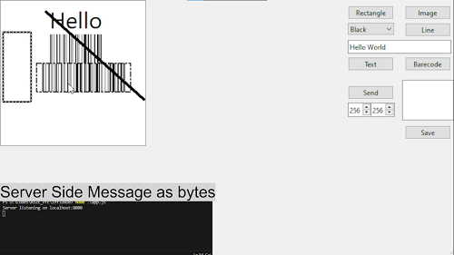

# Paint Application with TCP Data Transmission

## Description

This project is a paint-like application developed in Qt. It not only provides a creative canvas for digital drawing but also demonstrates the capability to send data over a TCP connection, specifically to a localhost. The accompanying video sample illustrates the process of sending data, while the server-side functionality is implemented in JavaScript. The server sets up a localhost server and displays the received data.

## Features

- Paint-like application with a user-friendly interface.
- TCP data transmission between the Qt application and a localhost server.
- Example server-side implementation in JavaScript.

## Video Demo

Click on the above image to watch the video demonstration showcasing how data is sent from the Qt application to the localhost server.

## Barcode Integration

To test barcode functionality, the project utilizes the [code128](https://github.com/fhunleth/code128/tree/main) library. Feel free to explore and use alternative barcode libraries based on your preferences.
